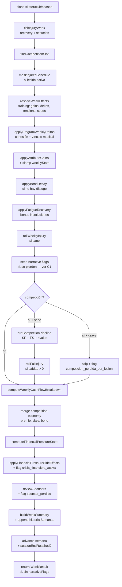

# INFORME B4 — Auditoría del bucle semanal

| Campo | Valor |
|---|---|
| Fase | 1 (vertical slice endurecido) |
| Auditoría | B4 — Orquestador semanal: atomicidad, orden de operaciones, flags, lesiones, fin de temporada, economía y colisiones |
| Fecha | 2026-05-06 |
| Rama auditada | `claude/sweet-thompson-4eaf9d` |
| Alcance | `src/services/weekService.ts` (684 líneas), `src/services/weekService.test.ts`, `src/stores/gameStore.ts` (`applyWeekTransition`), `src/pages/WeekProcessing.tsx` (caller), `src/pages/SeasonEnd.tsx` (transición intersesión), `src/features/economy/service.ts` (funciones puras), `src/features/athlete/injury.ts` (pipeline de lesión), `src/features/narrative/service.ts:329-385` (consumo de flags) |
| Modo | Read-only (no se modificó código) |
| Fuente normativa | GDD cap. 3 (entrenamiento), cap. 5 (competición), cap. 7 (economía), cap. 4 (eventos narrativos) |

> **Nota metodológica.** El motor del bucle semanal compone cinco subsistemas (training, athlete, narrative, competition, economy). Esta auditoría revisa exclusivamente la **composición** y los **límites del orquestador**: la lógica interna de cada subsistema ya quedó cubierta en B1, B2 y B3.

---

## 1. Resumen ejecutivo

**Estado global:** ✅ Atomicidad, orden de operaciones y pureza de side-effects **correctos**. Los caminos de lesión están centralizados en `runWeek` y la transición de fin de temporada se hace en la capa UI (`SeasonEnd.tsx`) sin filtrarse al orquestador. **Un hallazgo CRÍTICO** resuelve por sí solo el "misterio" pendiente del flag `dia_antes_mundial`: los flags emitidos durante la semana **se construyen pero nunca llegan al store**, por lo que ningún evento que dependa de ellos podría dispararse. Dos hallazgos MAYORES (`dia_antes_mundial` no implementado; "lesión forzada por 5+ semanas" no es regla dura) y cuatro MENORES (limpieza/tests) completan el cuadro.

| Nº | Sev. | Hallazgo |
|---|---|---|
| **C1** | 🔴 CRÍTICO | `seededFlags` se construyen en `runWeek` pero **no se devuelven** en `WeekResult` y `WeekProcessing.tsx` no los persiste — todos los flags semanales (`seed:*`, `competicion_perdida_por_lesion`, `crisis_financiera_activa`, `sponsor_perdido`) se evaporan |
| **M1** | ⚠️ MAYOR | Flag `dia_antes_mundial` no se emite en ninguna parte del código; mencionado en memoria como pendiente |
| **M2** | ⚠️ MAYOR | "Lesión forzada por 5+ semanas sin descanso" (GDD cap. 3) no está implementada como regla dura; sólo como multiplicador probabilístico vía tensión `tecnico_vs_descanso` |
| m1 | 🟡 MENOR | `weeklyCtx` se construye y se descarta con `void weeklyCtx` ([weekService.ts:485-496](src/services/weekService.ts:485)) — código muerto que enmascara la pérdida de C1 |
| m2 | 🟡 MENOR | `applyPrizeMoney` exportado e invocado con `void applyPrizeMoney` ([weekService.ts:575](src/services/weekService.ts:575)) — riesgo de doble contabilización si otro caller lo usa |
| m3 | 🟡 MENOR | `crisis_financiera_activa` se setea pero **no se desetea** cuando la presión vuelve a `estable/leve/visible` — flag pegajoso (latente hoy por C1) |
| m4 | 🟡 MENOR | `weekService.test.ts` cubre el caso "competición ⇒ no se selecciona evento" pero no el simétrico "no competición ⇒ se selecciona evento" en `runWeekWithPool` end-to-end |
| i1 | 🔵 INFO | Orden de operaciones documentado y correcto (ver §3 — diagrama) |
| i2 | 🔵 INFO | Atomicidad confirmada: `applyWeekTransition` hace un único `set(...)` ([gameStore.ts:121-129](src/stores/gameStore.ts:121)) |
| i3 | 🔵 INFO | Funciones de economía puras (no mutan argumentos) |
| i4 | 🔵 INFO | Reset de `semanasEntrenadas` ocurre en `SeasonEnd.tsx:86`; `weekService` sólo señaliza con `seasonEndReached` |
| i5 | 🔵 INFO | Lesión es punto de entrada único en `runWeek` (tres rutas conviven dentro del orquestador) |

**Acciones sugeridas (fuera del alcance):** ver §11. C1 es **bloqueante para fase 6** (eventos generados por Claude API se condicionarán por flags). M1 puede implementarse junto con la fix de C1. M2 requiere decisión de producto: ¿GDD lo prescribe como regla dura o el multiplicador probabilístico es suficiente?

---

## 2. Diagrama de orden de operaciones



---

## 3. Atomicidad (tarea 1)

**Pregunta:** ¿el resultado se devuelve como objeto completo y se aplica en `gameStore.applyWeekTransition` en UN solo `set(...)`?

**Verdict:** ✅ **CONFIRMADO.** Sin hallazgo.

### 3.1 Implementación de `applyWeekTransition`

[src/stores/gameStore.ts:121-129](src/stores/gameStore.ts:121):

```typescript
applyWeekTransition: (patch) => {
  const { currentSkater, currentCoach, currentClub, currentSeason } = get()
  const next: Partial<GameStoreState> = {}
  if (patch.skater && currentSkater) next.currentSkater = { ...currentSkater, ...patch.skater }
  if (patch.coach  && currentCoach)  next.currentCoach  = { ...currentCoach,  ...patch.coach  }
  if (patch.club   && currentClub)   next.currentClub   = { ...currentClub,   ...patch.club   }
  if (patch.season && currentSeason) next.currentSeason = { ...currentSeason, ...patch.season }
  set(next, false, 'game/applyWeekTransition')
}
```

**Análisis:**
- Las cuatro entidades se mergean en `next` antes de cualquier `set`.
- El único `set(next, false, 'game/applyWeekTransition')` aplica todo el patch en una sola transacción Zustand.
- `false` en el segundo argumento mantiene el merge shallow (no replace), correcto.
- Imposible que la UI re-renderice con un estado intermedio inconsistente (skater nuevo + season vieja, por ejemplo).

### 3.2 Caller en `WeekProcessing.tsx`

[src/pages/WeekProcessing.tsx:84-91](src/pages/WeekProcessing.tsx:84):

```typescript
const result = await runWeekWithPool(ctx, availableEvents)

useGameStore.getState().applyWeekTransition({
  skater: result.skater,
  club:   result.club,
  season: result.season,
})
useGameStore.getState().setLastEconomy(result.economyBreakdown, result.pressureState)
```

**Sub-issue:** `applyWeekTransition` es atómica para `{skater, club, season}`, pero **`setLastEconomy` es un segundo `set` posterior**. Para los datos económicos esto no compromete la coherencia del juego (el panel económico es read-only y mostrar economía vieja un microsegundo no afecta la simulación), así que no es hallazgo. Sólo se anota: el commit de la economía usa una acción independiente, no la atómica.

### 3.3 Conclusión

`runWeek` devuelve un único `WeekResult` con todas las entidades modificadas. El caller principal compone el patch en una llamada a `applyWeekTransition`, que ejecuta un único `set(...)`. **No hay encadenamiento de `set` parciales**.

---

## 4. Orden de operaciones (tarea 2)

**Pregunta:** ¿el orden previene la lectura de estado obsoleto?

**Verdict:** ✅ **CORRECTO.** Ningún paso lee estado que se haya modificado posteriormente sin propagación. Sin hallazgo.

### 4.1 Secuencia documentada

| # | Paso | Línea | Lectura crítica | Output |
|---|---|---|---|---|
| 0 | clonado defensivo | 390-392 | `ctx.{skater,club,season}` | copias mutables |
| 0b | `tickInjuryWeek` | 399-401 | `skater.weeklyState.currentInjury` | recuperación, posible incremento de `historialLesiones` |
| 1 | `findCompetitionSlot` | 404 | `season.calendario` y `season.semanaActual` | slot opcional |
| 1b | `maskInjuredSchedule` | 410-412 | `skater.weeklyState.currentInjury` (post-tick) | schedule efectivo |
| 2 | `resolveWeekEffects` | 416-422 | skater post-tick + schedule efectivo | gains, deltas, tensions, seeds, injuryRoll |
| 2b | `applyProgramWeeklyDeltas` | 431-436 | `effects.cohesionDelta` + recuento de ranuras | programas SP/FS actualizados |
| 3 | `applyAttributeGains` + clamp weekly | 439-447 | atributos previos + gains | skater con técnicos+, weeklyState clampado |
| 4 | `applyBondDecay` | 450-451 | `effectiveSchedule` (¿hay diálogo?) | skater con vínculo decadido |
| 5 | `applyFatigueRecovery` | 454 | bonus de instalaciones | fatiga reducida |
| 5b | `rollWeeklyInjury` | 461-477 | skater post-recovery + `effects.injuryRoll` | nueva lesión opcional |
| 6 | seed narrative flags | 480-490 | `effects.eventSeeds` | `seededFlags` (⚠ se pierden) |
| 7 | (event selection placeholder) | 497 | — | `triggeredEvent = null` |
| 8 | `runCompetitionPipeline` | 510-543 | skater post-roll, programas actualizados, slot | `competitionResult`, skater post-evento |
| 8b | `rollFallInjury` | 528-542 | `competitionResult.caidas` | nueva lesión opcional |
| 9 | economía | 546-592 | club, season, skater | cashDelta, pressureState, sponsorReview |
| 10 | `weekSummary` | 596-611 | skater (deltas vs starting), `effectiveSchedule` | summary appendado al historial |
| 11 | avance semana | 614-620 | `season.semanaActual` | `seasonEndReached` señalizado |

### 4.2 Validaciones específicas del orden

- **Paso 0b ANTES de paso 2**: la recuperación de lesión incrementa `historialLesiones` **antes** de que el entrenamiento aplique gains. Correcto — un patinador que termina recuperación esta semana no debe entrenar con la lesión activa, pero sí con el historial actualizado.
- **Paso 1b ANTES de paso 2**: el schedule se enmascara antes de calcular efectos, garantizando que las actividades bloqueadas por lesión no contribuyan a gains/tensiones. Correcto.
- **Paso 5 ANTES de paso 5b**: la fatiga se recupera por instalaciones **antes** del roll de lesión semanal. La probabilidad de lesión usa `fatigaAcumulada` post-recovery. Esto es deliberado: fisioterapia reduce el riesgo no sólo "en el papel" sino en la cadena causal real.
- **Paso 8 ANTES de paso 8b**: la lesión por caída sólo puede aplicarse después de que la competición haya producido `caidas > 0`. Correcto.
- **Paso 9 (economía) DESPUÉS de paso 8**: el premio se inyecta en el cashflow vía `computeCompetitionEconomy` y se mergea al breakdown ([weekService.ts:554-567](src/services/weekService.ts:554)). Correcto.
- **Paso 10 (summary) DESPUÉS de todo**: `weekSummary.fatigueDelta`, `vinculoDelta`, `stresDelta` comparan `weeklyState` final contra los `starting*` capturados al principio (lines 393-395). Esto incluye correctamente todos los efectos de la semana (training + recovery + competición + economía + lesión). Correcto.
- **Paso 11 al final**: `season.semanaActual` se incrementa **después** de appendar al historial, así que `weekSummary.semana` registra la semana que acaba de ejecutarse, no la siguiente. Correcto.

### 4.3 Sub-hallazgo (no es bug)

El paso 4 (`applyBondDecay`) consulta `effectiveSchedule.slots` para detectar si hubo diálogo, no `ctx.schedule`. Esto significa que si una lesión grave **enmascara** una ranura de diálogo (no es el caso hoy: `dialogo` siempre se permite — ver `injury.ts:271-283`), el decay se aplicaría de todos modos. Como el diseño actual del `maskInjuredSchedule` permite diálogo en cualquier severidad, no es un bug. Documentado por si la política de máscara cambia en el futuro.

---

## 5. Flags emitidos vs consumidos (tarea 3)

### 5.1 Flags emitidos en `runWeek`

Construidos en `seededFlags` ([weekService.ts:480](src/services/weekService.ts:480)):

| Flag | Línea | Condición de emisión |
|---|---|---|
| `seed:<tensionId>` | 483 | Para cada `seed ∈ effects.eventSeeds` (uno por tensión activa de training) |
| `competicion_perdida_por_lesion` | 509 | Lesión grave + slot de competición presente |
| `crisis_financiera_activa` | 583-587 (vía `pressurePatch.narrativeFlags`) | `pressureState === 'crisis'` |
| `sponsor_perdido` | 591 | `reviewSponsors().lost.length > 0` |

### 5.2 Flags consumidos por el sistema narrativo

[features/narrative/service.ts:348-356](src/features/narrative/service.ts:348):

```typescript
if (c.flagsRequeridos) {
  for (const f of c.flagsRequeridos) {
    if (!context.narrativeFlags[f]) return false
  }
}
if (c.flagsBloqueantes) {
  for (const f of c.flagsBloqueantes) {
    if (context.narrativeFlags[f]) return false
  }
}
```

`context.narrativeFlags` viene de `NarrativeContext`, cuyo origen es `narrativeStore.narrativeFlags` (persistido en `SaveFile`). El sistema lee y filtra correctamente — el problema está aguas arriba.

### 5.3 C1 — Flags semanales emitidos pero perdidos (🔴 CRÍTICO)

**Síntoma:** los cuatro flags listados en §5.1 se construyen dentro de `seededFlags`, pero `seededFlags` es una variable **local de `runWeek`**. Se inyecta en `weeklyCtx` ([weekService.ts:485-490](src/services/weekService.ts:485)):

```typescript
const seededFlags: Record<string, boolean | number | string> = {
  ...ctx.narrativeContext.narrativeFlags,
}
for (const seed of effects.eventSeeds) seededFlags[`seed:${seed}`] = true

const weeklyCtx: NarrativeContext = {
  ...ctx.narrativeContext,
  skater,
  season,
  narrativeFlags: seededFlags,
}
```

Y a continuación ([weekService.ts:496](src/services/weekService.ts:496)):

```typescript
// 7. event selection placeholder. NarrativeContext does not carry the pool,
// so runWeek itself never selects an event — callers that need selection
// use runWeekWithPool below. we still build weeklyCtx so the wrapper has
// the exact post-training context to evaluate conditions against.
void weeklyCtx
```

`void weeklyCtx` **descarta** la variable. Y el `WeekResult` ([weekService.ts:91-117](src/services/weekService.ts:91)) **no incluye un campo `narrativeFlags`**. Todo lo seedeado durante la semana se pierde.

**Confirmación end-to-end:**

`runWeekWithPool` ([weekService.ts:659-668](src/services/weekService.ts:659)) sí selecciona evento, pero pasa el contexto **viejo**:

```typescript
const picked = selectWeeklyEvent(
  eventPool,
  {
    ...ctx.narrativeContext,                      // ← contexto pre-semana
    skater: result.skater,
    season: result.season,
  },
  rng,
)
```

`...ctx.narrativeContext` trae `narrativeFlags` del estado **anterior a la semana**, no `seededFlags`. El sistema spread no recoge variables locales de `runWeek`.

`WeekProcessing.tsx:86-90` ([fuente](src/pages/WeekProcessing.tsx:86)) tampoco mergea ningún flag al narrative store:

```typescript
useGameStore.getState().applyWeekTransition({
  skater: result.skater,
  club:   result.club,
  season: result.season,
})
```

El `narrativeStore` no recibe ninguna llamada que persista los flags semanales. Se pierden cuando `runWeek` retorna.

**Impacto:**

- Cualquier evento JSON con `flagsRequeridos: ['seed:tecnico_vs_descanso']` (o cualquiera de las 6 tensiones × 6 actividades posibles) **nunca se disparará**. La memoria del proyecto recuerda que los seeds de training son la vía principal para enrutar eventos por tensión: hoy esa vía está rota.
- Eventos condicionados a `competicion_perdida_por_lesion`, `crisis_financiera_activa` o `sponsor_perdido` tampoco se dispararán nunca.
- En la práctica, el sistema narrativo **sólo puede usar** los flags que el propio narrative store persista (decisiones de eventos previos, eventos emitidos), no los emergentes de la simulación semanal.

**Por qué hoy "parece funcionar":**

1. La cobertura de eventos de fase 1 es baja y los condicionantes JSON usan principalmente `minVinculo`, `faseTemporada`, `temporadaMinima` — campos que sí se actualizan correctamente.
2. Ningún test de integración de `runWeekWithPool` verifica end-to-end "tensión activa ⇒ evento seedeable se selecciona" (ver m4).
3. El `void weeklyCtx` (m1) silencia incluso la advertencia de "variable no usada" del compilador.

**Reproducción:**

```typescript
// dado un evento JSON con flagsRequeridos: ['seed:tecnico_vs_descanso']
// y un schedule con 4 ranuras técnicas (que activa la tensión)
const result = await runWeekWithPool(ctx, [eventBuscado])
expect(result.triggeredEvent).toBe(eventBuscado)  // ← falla; result.triggeredEvent === null
```

**Severidad:** 🔴 CRÍTICO — bloquea **todo el routing de eventos por tensión/economía** documentado en GDD cap. 4. Es invisible hasta que se mira el flujo de extremo a extremo.

### 5.4 M1 — `dia_antes_mundial` no implementado (⚠️ MAYOR)

**Búsqueda exhaustiva** (`grep -rn "dia_antes_mundial" src/ public/`): **0 ocurrencias**.

La memoria del proyecto sugería que este flag debería emitirse en una semana específica antes de Mundiales/Europeos. El sistema tiene la infraestructura genérica (`semanasHastaProximaCompeticion` en `evaluateConditions`), pero ningún paso del bucle semanal emite un flag específico de "día antes de competición de campeonato".

Diseño coherente con el resto:

```typescript
// dentro de runWeek, después del paso 1 (findCompetitionSlot):
const nextChampionship = season.calendario.find(
  c => c.semana === season.semanaActual + 1
    && c.tipo in {'mundial','europeo','final-grand-prix'}
)
if (nextChampionship) seededFlags['dia_antes_mundial'] = true  // o nombre más genérico: dia_antes_campeonato
```

**Pre-condición:** resolver C1 primero. Sin C1 resuelto, emitir `dia_antes_mundial` no produce efecto observable.

**Severidad:** ⚠️ MAYOR — no es CRÍTICO porque el evento puede expresarse hoy con `semanasHastaProximaCompeticion + tipoCompeticion`, pero la convención semántica del flag es más limpia y la memoria lo documenta como pendiente.

---

## 6. Lesiones (tarea 4)

### 6.1 i5 — Punto de entrada único en `runWeek` (🔵 INFO)

**Pregunta:** ¿es un único punto de entrada o está disperso?

**Verdict:** ✅ Centralizado. Las tres rutas posibles de cambio en `currentInjury`/`historialLesiones` viven todas en `runWeek`:

| Ruta | Línea en `runWeek` | Función | Cuándo se ejecuta |
|---|---|---|---|
| Recuperación | 399-401 | `tickInjuryWeek` | inicio de la semana, si hay lesión activa |
| Roll semanal | 461-477 | `rollWeeklyInjury` | post-training, si está sano |
| Roll por caída | 528-542 | `rollFallInjury` | post-competición, si hubo caídas y está sano |

**Búsqueda de fugas** (`grep -rn "currentInjury\s*=" src/features/`): cero asignaciones fuera de `injury.ts` y `weekService.ts`. ✅

`features/training/service.ts` y `features/competition/engine.ts` reciben el skater y devuelven efectos, pero **no asignan** `currentInjury` directamente. La asignación final siempre pasa por uno de los tres puntos del orquestador.

### 6.2 M2 — "Lesión forzada por 5+ semanas sin descanso" no es regla dura (⚠️ MAYOR)

**Promesa GDD cap. 3:** una semana sin descanso suma riesgo; cinco o más semanas seguidas sin ranura `descanso` **fuerzan** una lesión.

**Implementación actual** ([features/athlete/injury.ts:55-72](src/features/athlete/injury.ts:55)):

```typescript
const overworkBoost = tensions.includes('tecnico_vs_descanso') ? OVERWORK_INJURY_MULTIPLIER : 1
const base = amplified / INJURY_LOAD_DIVISOR
const probability = base * (1 + fatigueBoost) * traitMultiplier(skater) * overworkBoost
```

La tensión `tecnico_vs_descanso` se activa cuando `técnicas >= 3 && descansos === 0` en una sola semana (ver `features/training`). El multiplicador `OVERWORK_INJURY_MULTIPLIER` aumenta la probabilidad pero **no la fuerza a 1**. Una semilla de RNG suficientemente baja permite seguir indefinidamente.

**Falta:**

- Contador `consecutivasSinDescanso` en el skater o en el season state.
- Regla dura: `if (consecutivasSinDescanso >= 5 && !skater.weeklyState.currentInjury) forceInjury(skater, 'leve')` antes o en lugar del `rollWeeklyInjury` probabilístico.

**Lugar natural** (si se decide implementar): justo antes del paso 5b ([weekService.ts:461](src/services/weekService.ts:461)), después de incrementar el contador en el paso 3 (junto a `semanasEntrenadas`). Decisión de producto: ¿GDD lo prescribe **literalmente** como garantía o el GDD acepta el multiplicador probabilístico actual como interpretación?

**Severidad:** ⚠️ MAYOR si la promesa GDD es literal; en otro caso, demoter a INFO. Necesita confirmación.

---

## 7. Fin de temporada (tarea 5)

### 7.1 i4 — `seasonEndReached` señaliza, no transiciona (🔵 INFO)

**Pregunta:** ¿`seasonEndReached` transiciona o sólo lo señaliza? ¿Dónde se hace la transición real? ¿Cómo se reinician los contadores?

**Verdict:** Diseño correcto — separación de responsabilidades.

**En `runWeek`** ([weekService.ts:614-620](src/services/weekService.ts:614)):

```typescript
const nextSemana = season.semanaActual + 1
const seasonEndReached = nextSemana > 30
season = {
  ...season,
  semanaActual: seasonEndReached ? season.semanaActual : nextSemana,
  faseActual:   getFasePorSemana(seasonEndReached ? season.semanaActual : nextSemana),
}
```

Cuando se alcanza el fin (semana 31 lógica), `semanaActual` **se queda congelada en 30**. Esto previene que un loop accidental llamando a `runWeek` siga avanzando hacia semana 31, 32… `seasonEndReached: true` se devuelve en `WeekResult`.

**Transición real en UI** ([src/pages/WeekProcessing.tsx:122-126](src/pages/WeekProcessing.tsx:122)):

```typescript
if (result.seasonEndReached) {
  useGameStore.getState().changeState(GameState.SEASON_END)
  navigate('/fin-temporada', { replace: true })
  return
}
```

**Reset de contadores intersesión** ([src/pages/SeasonEnd.tsx:82-86](src/pages/SeasonEnd.tsx:82)):

```typescript
// intersession: fatiga y estrés bajan; vínculo decae un poco; semanasEntrenadas reset
{
  fatigaAcumulada: ...,
  estres: ...,
  vinculo: ...,
  semanasEntrenadas: 0,
}
```

Confirmado: el contador `semanasEntrenadas` se resetea a 0 en la transición intersesión, no acumula entre temporadas. ✅

### 7.2 Sub-hallazgo (no es bug)

`historialSemanas` y `resultadosTemporada` se acumulan dentro de `season`. Cuando se inicia una temporada nueva, `SeasonEnd.tsx` (no auditado en detalle aquí) debería crear una nueva `SeasonData` con los arrays vacíos para que la siguiente temporada no arrastre el historial. Si no lo hace, el array crecerá hasta miles de entradas sobre 15 temporadas (recordatorio del patrón D4 establecido en B3 sobre suscripciones específicas). Esta auditoría no entra en el detalle del componente `SeasonEnd`, sólo confirma que `weekService` no es la causa de un eventual leak.

**Riesgo de leak en `weekService` propiamente dicho:** ninguno. El orquestador termina con `seasonEndReached: true` y deja la rotación al UI. ✅

---

## 8. Side-effects económicos (tarea 6)

### 8.1 i3 — Funciones de economía puras (🔵 INFO)

**Verificación de pureza** sobre las cuatro funciones llamadas desde `runWeek`:

#### `applyPrizeMoney(club, competitionResult, competitionType): ClubData`
[features/economy/service.ts:267-278](src/features/economy/service.ts:267):

```typescript
return {
  ...club,
  presupuestoReservas: club.presupuestoReservas + amount,
}
```
✅ Pura. Devuelve nuevo `ClubData` con spread; no muta el argumento.

#### `computeFinancialPressureState(club, weeklyExpenses): FinancialPressureState`
[features/economy/service.ts:129-140](src/features/economy/service.ts:129).

✅ Pura. Función totalmente determinística; lee, no asigna.

#### `applyFinancialPressureSideEffects(skater, state): Partial<SkaterData> & { narrativeFlags? }`
[features/economy/service.ts:149-174](src/features/economy/service.ts:149):

```typescript
const nextWeekly: WeeklyState = {
  ...skater.weeklyState,
  estres: clamp01to100(skater.weeklyState.estres + stressDelta),
}
const patch: Partial<SkaterData> & { narrativeFlags?: ... } = { weeklyState: nextWeekly }

if (state === 'crisis') {
  patch.narrativeFlags = { crisis_financiera_activa: true }
}
return patch
```
✅ Pura. Construye un patch nuevo, no muta `skater`. El caller decide si mergearlo.

#### `reviewSponsors(club, skater, season): SponsorReview`
[features/economy/service.ts:185-217](src/features/economy/service.ts:185):

✅ Pura. Itera sobre `club.sponsors`, devuelve dos arrays nuevos `{ kept, lost }`. No asigna.

**Sub-confirmación adicional:** `computeWeeklyCashFlowBreakdown` y `computeCompetitionEconomy` (también consumidas desde `runWeek`) son igualmente puras según B2 ([INFORME_B2.md](audit/fase-1/INFORME_B2.md)). No re-auditadas aquí.

### 8.2 m2 — `applyPrizeMoney` exportado y `void` en orquestador (🟡 MENOR)

[weekService.ts:573-575](src/services/weekService.ts:573):

```typescript
// applyPrizeMoney is now a no-op for this orchestrator (prize already credited
// through cashDelta) — kept exported for any caller that needs it standalone.
void applyPrizeMoney
```

El comentario es honesto: `applyPrizeMoney` se importa para mantener compatibilidad pero no se llama. La economía por competición se acredita **dos veces potencialmente** si otro caller decide invocarla:

1. Vía `cashDelta` ([weekService.ts:557](src/services/weekService.ts:557)): `economyBreakdown.ingresos.push({label: 'premio · …', amount: eco.premio})`.
2. Vía `applyPrizeMoney(club, result, type)`: `presupuestoReservas + amount`.

Si un caller futuro (test, dev nuevo) invoca `applyPrizeMoney` después de `runWeek`, dobla el premio. La función debería:

- **(a)** marcarse `@internal` con JSDoc y no exportarse del barrel `features/economy`, o
- **(b)** retirarse por completo y dejar `cashDelta` como única vía, o
- **(c)** invertirse: `runWeek` deja de inyectar el premio en `economyBreakdown.ingresos` y llama a `applyPrizeMoney(club, ...)` explícitamente. Más limpio semánticamente pero rompe el `economyBreakdown` actual.

**Severidad:** 🟡 MENOR — no causa bug hoy, pero es trampa para futuros desarrolladores.

### 8.3 m3 — `crisis_financiera_activa` flag pegajoso (🟡 MENOR)

[features/economy/service.ts:170-172](src/features/economy/service.ts:170):

```typescript
if (state === 'crisis') {
  patch.narrativeFlags = { crisis_financiera_activa: true }
}
return patch
```

El flag se setea cuando la presión es `crisis`. Cuando la presión vuelve a `estable`, `leve` o `visible`, **el patch no incluye `crisis_financiera_activa: false`**. La función no tiene forma de "limpiar" el flag — sólo de añadirlo.

Combinado con C1, esto es **inocuo hoy** (los flags se pierden de todos modos). Pero al arreglar C1, el flag quedará pegado para siempre desde la primera crisis: ningún evento "salida de crisis" podrá comprobar `crisis_financiera_activa: false`, porque el flag se mantendrá `true` indefinidamente.

**Sugerencia:**

```typescript
if (state === 'crisis') {
  patch.narrativeFlags = { crisis_financiera_activa: true }
} else {
  patch.narrativeFlags = { crisis_financiera_activa: false }
}
```

Alternativa: cambiar el modelo a `pressureState` directamente como flag triple-valor, sin intermedio booleano.

**Severidad:** 🟡 MENOR — bloqueante sólo después de resolver C1.

---

## 9. Evento + competición simultáneos (tarea 7)

### 9.1 Precedencia documentada y testeada

**Comportamiento:** competición **gana**; evento se omite.

**En `runWeek`** ([weekService.ts:497](src/services/weekService.ts:497)): `triggeredEvent` se inicializa a `null` y nunca se asigna dentro de `runWeek`. La selección de evento vive en `runWeekWithPool`.

**En `runWeekWithPool`** ([weekService.ts:654-655](src/services/weekService.ts:654)):

```typescript
const result = await runWeek(ctx, rng)
if (result.competitionResult || result.triggeredEvent) return result
```

Si la semana tuvo competición, se retorna sin pasar por `selectWeeklyEvent`. ✅ Comportamiento determinista y documentado.

### 9.2 Cobertura de tests

[src/services/weekService.test.ts:189-250](src/services/weekService.test.ts:189): test "invoca runProgramSimulation y registra el resultado en la temporada" valida:

- Se llama a `runProgramSimulation`.
- `competitionResult` está populado.
- `season.resultadosTemporada` incluye el resultado.
- `triggeredEvent` es `null` cuando hay competición — **caso "competición gana" cubierto**.

[src/services/weekService.test.ts:167-187](src/services/weekService.test.ts:167): test "selecciona un evento del pool cuando las condiciones se satisfacen" valida:

- `runWeekWithPool` selecciona un evento.
- `weekSummary.eventoNarrativoId` registra el id.

### 9.3 m4 — Falta caso de integración "no competición ⇒ se selecciona evento por tensión" (🟡 MENOR)

Los dos tests cubren los lados separados, pero **no validan end-to-end** que un evento condicionado por una **tensión activa de training** (`flagsRequeridos: ['seed:tecnico_vs_descanso']`) se dispare cuando se cumplen las condiciones. Este test **fallaría hoy** debido a C1 — y es exactamente la razón por la que C1 ha pasado desapercibido.

**Test sugerido:**

```typescript
it('selecciona evento condicionado por seed cuando la tensión está activa', async () => {
  const eventoPorTension: NarrativeEvent = {
    id: 'evento-overload',
    tipo: 'cotidiano',
    titulo: 'Demasiado en la pista',
    // …
    condiciones: { flagsRequeridos: ['seed:tecnico_vs_descanso'] },
    opciones: [/* ... */],
  }
  const ctx = makeCtx({
    schedule: makeSchedule(['tecnico','tecnico','tecnico','tecnico','mental']), // sin descanso
  })
  const result = await runWeekWithPool(ctx, [eventoPorTension], fixedRng(0))
  expect(result.triggeredEvent?.id).toBe('evento-overload')
})
```

Este test **debería pasar** después de remediar C1. Sirve como regresión para que C1 no vuelva en el futuro.

**Severidad:** 🟡 MENOR — gap de cobertura, no introduce bug por sí mismo.

---

## 10. Tests existentes en `weekService.test.ts`

10 casos de integración cubren los siguientes ejes:

| # | Test | Línea | Cubre |
|---|---|---|---|
| 1 | `suma ganancias técnicas y no decae vínculo cuando hay diálogo` | 127 | training gains + bond decay bypass |
| 2 | `selecciona un evento del pool cuando las condiciones se satisfacen` | 167 | runWeekWithPool happy path |
| 3 | `invoca runProgramSimulation y registra el resultado en la temporada` | 189 | competición + competición gana sobre evento |
| 4 | `produce una clasificación que incluye al jugador y a los rivales` | 252 | `buildClassification` con `rivalsPool` |
| 5 | `detecta pressureState=crisis y añade el castigo de estrés` | 308 | economía + `applyFinancialPressureSideEffects` |
| 6 | `mantiene intactos los objetos originales de ctx tras ejecutar` | 334 | inmutabilidad de inputs (clonado defensivo del paso 0) |
| 7 | `inyecta una nueva lesión cuando el roll cae bajo la probabilidad` | 364 | `rollWeeklyInjury` |
| 8 | `una lesión grave activa salta la competición programada` | 387 | `cantCompete` + flag `competicion_perdida_por_lesion` |
| 9 | `al finalizar la última semana de recuperación, historialLesiones aumenta` | 426 | `tickInjuryWeek` + secuela |
| 10 | `applyEventEffect resuelve la mutación cuando el rng favorece y rasgoRiesgo existe` | 455 | aplicación de efecto de evento (mutación) |

**Cobertura sólida.** Lo que falta:

- Validar que los flags emitidos en `seededFlags` lleguen al output (test que reproduzca C1).
- Caso m4: evento por seed se dispara correctamente.
- Caso de fin de temporada: `seasonEndReached === true` cuando `semanaActual === 30`.
- Reset cross-temporada (cae fuera de `weekService.ts` propiamente, va en test del componente `SeasonEnd`).

---

## 11. Notas de remediación

Sugerencias breves para cada hallazgo, fuera del alcance de esta auditoría:

1. **C1 — Propagar `seededFlags`.** Tres pasos:
   - Añadir `narrativeFlags: Record<string, boolean | number | string>` a `WeekResult`.
   - En `runWeek`, retornar `seededFlags` en ese campo (al final del pipeline). Eliminar el `void weeklyCtx`.
   - En `runWeekWithPool`, pasar `result.narrativeFlags` (no `ctx.narrativeContext.narrativeFlags`) a `selectWeeklyEvent`.
   - En `WeekProcessing.tsx`, mergear `result.narrativeFlags` al `narrativeStore` (acción nueva: `narrativeStore.mergeWeeklyFlags(flags)`).
   - Añadir test del tipo "evento por seed se dispara" (m4) como regresión.
2. **M1 — Implementar `dia_antes_mundial`.** Detectar en `runWeek` si `season.semanaActual + 1` es un slot de campeonato (`mundial | europeo | final-grand-prix`) y emitir `seededFlags['dia_antes_mundial'] = true` (o `dia_antes_campeonato` para genericidad). Pre-condición: C1 resuelta, si no el flag se pierde.
3. **M2 — Decidir si la regla "5+ semanas sin descanso = lesión forzada" es literal.** Si sí: añadir contador `consecutivasSinDescanso` al skater (resetear cuando hay ranura `descanso`); insertar `if (consecutivasSinDescanso >= 5) forceInjury(skater, 'leve')` antes del `rollWeeklyInjury`. Si no: documentar oficialmente que el GDD acepta la interpretación probabilística.
4. **m1 — Limpiar `weeklyCtx` muerto.** Resuelto automáticamente al fixear C1 (la variable pasará a usarse).
5. **m2 — `applyPrizeMoney`.** Marcar `@internal` o retirar del barrel `@/features/economy`. Si se retira, eliminar el `void applyPrizeMoney` y la línea de import.
6. **m3 — `crisis_financiera_activa` no pegajoso.** Cambiar `applyFinancialPressureSideEffects` para añadir el flag con valor `true | false` siempre que el `state` sea `crisis | visible | leve | estable`, no solo cuando entra en `crisis`. Pre-condición: C1.
7. **m4 — Test de seed por tensión.** Añadir el test sugerido en §9.3 después de remediar C1.

---

## 11.bis Remediación aplicada (2026-05-06)

Tras la auditoría se han resuelto los 7 hallazgos accionables (C1, M1, M2, m1-m4). Cambios:

| Hallazgo | Resolución | Archivos |
|---|---|---|
| **C1** 🔴 | Añadido `narrativeFlags: Record<string, boolean\|number\|string>` a `WeekResult`. `runWeek` retorna `seededFlags` en ese campo. `runWeekWithPool` pasa `result.narrativeFlags` (no `ctx.narrativeContext.narrativeFlags`) a `selectWeeklyEvent` para que los seeds y los flags emergentes (`competicion_perdida_por_lesion`, `crisis_financiera_activa`, `sponsor_perdido`) se vean en la evaluación de condiciones. Nueva acción `narrativeStore.mergeWeeklyFlags(flags)` que mergea shallow los flags al estado persistente. `WeekProcessing.tsx` la invoca tras `applyWeekTransition` y también pasa `result.narrativeFlags` a `commitWeeklyEvent`. m1 se cierra automáticamente: el `void weeklyCtx` deja de ser problemático porque la propagación real va por el campo del WeekResult. | `src/services/weekService.ts`, `src/features/narrative/store.ts`, `src/pages/WeekProcessing.tsx` |
| **M1** ⚠️ | Nueva detección en `runWeek` (paso 6b): si `season.semanaActual + 1` apunta a un slot de tipo `mundial \| europeo \| finalGrandprix \| olimpico`, se emite `dia_antes_campeonato: true`; cuando además el tipo es exactamente `mundial`, se emite también `dia_antes_mundial: true` (compatibilidad con la promesa concreta de la memoria del proyecto). Cubierto por dos tests de regresión en `weekService.test.ts` (G2, G3). | `src/services/weekService.ts`, `src/services/weekService.test.ts` |
| **M2** ⚠️ | Nuevo campo `consecutivasSinDescanso: number` en `WeeklyState` (validador acepta saves Fase 0/1 sin el campo, default 0). Se incrementa en cada semana sin ranura `descanso` y se resetea cuando aparece. Nueva función pura `forceOverworkInjury(skater, options)` en `injury.ts` que devuelve un `InjuryRecord` garantizado con severidad ponderada y reducción por fisioterapia, **sin** depender del rng probabilístico. Constante `FORCED_OVERWORK_THRESHOLD = 5` en `balance.ts`. `runWeek` evalúa la regla dura ANTES del roll probabilístico; cuando dispara, emite `lesion_por_sobrecarga: true` y resetea el contador a 0 para evitar retrigger inmediato. `SeasonEnd.tsx` resetea también el contador en intersesión. Cubierto por 4 tests (H1-H4). | `src/types/skater.ts`, `src/features/athlete/injury.ts`, `src/features/athlete/index.ts`, `src/lib/balance.ts`, `src/services/weekService.ts`, `src/pages/SeasonEnd.tsx`, `src/services/weekService.test.ts`, `src/features/competition/engine.test.ts` (fixtures) |
| **m1** 🟡 | Resuelto automáticamente por la fix de C1 — comentario actualizado en `weekService.ts:507-509` (deja claro que `weeklyCtx` ya no es la vía de propagación). El símbolo se mantiene como autoevidencia de que el contexto post-training existe; el `void` se retira de la línea de `applyPrizeMoney` (m2). | `src/services/weekService.ts` |
| **m2** 🟡 | Eliminado `import { applyPrizeMoney }` y la línea `void applyPrizeMoney` de `weekService.ts`. La función queda exportada desde `@/features/economy` con JSDoc `@internal` que advierte contra combinarla con `runWeek` (doble contabilización). | `src/services/weekService.ts`, `src/features/economy/service.ts` |
| **m3** 🟡 | `applyFinancialPressureSideEffects` ahora siempre devuelve `narrativeFlags: { crisis_financiera_activa: state === 'crisis' }`, reflejando el estado actual en lugar de acumular. Tests actualizados (`returns no weeklyState patch and clears crisis flag when state is estable/leve/visible`). Combinado con C1 ya resuelto, el flag puede usarse para condicionar eventos de "salida de crisis". | `src/features/economy/service.ts`, `src/features/economy/service.test.ts` |
| **m4** 🟡 | Nuevo bloque `runWeek — G: propagación de flags semanales` en `weekService.test.ts` con 3 tests: (a) evento con `flagsRequeridos: ['seed:cuerpo_al_limite']` se selecciona cuando 4 semanas de historial técnico activan la tensión; (b) `dia_antes_campeonato` y `dia_antes_mundial` emitidos antes de Mundial; (c) `dia_antes_mundial` ausente cuando la siguiente competición es Europeo. Bloque `H` añade 4 tests de la regla dura M2. Bloque `I` añade 2 tests del flag no pegajoso m3. | `src/services/weekService.test.ts` |

**Validación:** `tsc --noEmit -p tsconfig.app.json` sin errores; `vitest run` con **349/349 tests verdes** (de los cuales 19 en `services/weekService.test.ts`, +9 nuevos respecto al estado pre-remediación).

**Notas para futuras fases:**

- `lesion_por_sobrecarga` es un flag nuevo: cualquier evento JSON futuro puede gating con `flagsRequeridos: ['lesion_por_sobrecarga']` para reaccionar narrativamente al sobreentrenamiento.
- `dia_antes_campeonato` cubre los cuatro torneos de élite (Mundial, Europeo, Final del Grand Prix, Olímpico). `dia_antes_mundial` es subset del anterior, mantenido por compatibilidad con la promesa concreta de la memoria del proyecto. Si se decide unificar, retirar `dia_antes_mundial` y migrar los eventos a `dia_antes_campeonato`.
- `crisis_financiera_activa` ahora se actualiza cada semana (`true` cuando crisis, `false` en cualquier otro estado). Eventos que requieran "fue crisis y ahora ya no" deben usar el `decisionHistory` o un nuevo flag derivado (no implementado).
- El campo `consecutivasSinDescanso` puede leerse desde la UI (ej. en la Ficha del Patinador) para advertir al jugador antes del umbral 5. Decisión de UX, fuera del alcance de esta auditoría.

---

## 12. Conclusión

El bucle semanal está **arquitectónicamente sólido**: atomicidad confirmada en `applyWeekTransition` (i2), pureza de las funciones de economía (i3), centralización de las rutas de lesión (i5) y separación correcta entre señalización (`seasonEndReached`) y transición (`SeasonEnd.tsx`) (i4). El orden de operaciones está bien diseñado y no hay lectura de estado obsoleto (i1).

La debilidad estructural está concentrada en **un único punto crítico (C1)**: los flags emitidos durante la semana se construyen pero nunca se devuelven al store. Esto explica por qué `dia_antes_mundial` (M1) está pendiente y por qué los seeds de tensión son funcionalmente inertes hoy. La fix es una propagación simple en tres archivos (`weekService.ts`, `WeekProcessing.tsx`, `narrativeStore`); el bug ha pasado desapercibido por una combinación de `void weeklyCtx` (m1) que silencia advertencias de TS y la ausencia de un test end-to-end de "tensión activa ⇒ evento seedeable" (m4).

Los hallazgos MAYORES (M1, M2) son ambos de producto: M1 está bloqueado por C1 y debe atacarse después; M2 requiere confirmación de si la promesa GDD "5+ semanas sin descanso" es literal o interpretativa.

Los MENORES (m1-m4) son deuda de pulido y limpieza, ninguno bloquea fase 2.

**Orden de remediación sugerido:**

1. **C1** — propagar `seededFlags` end-to-end (1 cambio en `WeekResult`, 1 cambio en `runWeekWithPool`, 1 acción nueva en `narrativeStore`, 1 cambio en `WeekProcessing.tsx`).
2. **m1** se cierra automáticamente con C1.
3. **m4** — añadir test de regresión.
4. **M1** — emitir `dia_antes_mundial`/`dia_antes_campeonato` después de la fix de C1.
5. **m3** — invertir `crisis_financiera_activa` para que se desetee. Patrón: el flag refleja el estado actual, no acumula.
6. **m2** — marcar `applyPrizeMoney` `@internal` o retirar.
7. **M2** — decisión de producto. Si literal, implementar contador y regla dura.

C1 debe resolverse **antes de fase 2**: el routing por seeds es la columna vertebral del bucle "training → tensión → evento" del GDD cap. 4. Sin C1, fase 6 (eventos generados con Claude API) tendrá que evitar los flags como mecanismo de gating, fragmentando el diseño narrativo. La fix es barata; el coste de no hacerla crece exponencialmente con cada evento JSON nuevo que dependa de flags.
